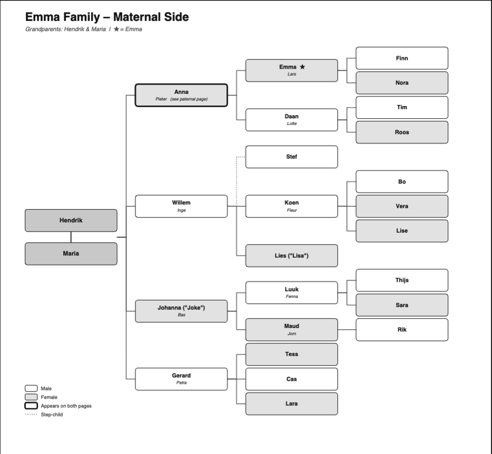

# Family Tree Generator

A Python tool that generates multilingual family tree PDFs from simple YAML files.

## Features

- Define your family in a readable YAML file — no coding needed
- Two-sided layout: maternal and paternal pages
- Multilingual output — ships with English (`en`), Dutch (`nl`), and Persian/Farsi (`fa`)
- Supports aliases, step-children, and bridge nodes (couples spanning both pages)
- RTL support for Persian/Farsi via the bundled Vazirmatn font and python-bidi



## Quick start

```bash
pip install -e .
family-tree
```

PDFs are written to `output/`. By default all available trees and all three languages are generated.

## Included example trees

| Tree | File | Description |
|------|------|-------------|
| Emma | `emma.yaml` | Fictional Dutch de Vries family, centred on Emma |
| Lars | `lars.yaml` | Fictional Dutch family of Lars (Emma's husband) |

Generated PDFs for both trees (English, Dutch, Persian) are in the [`output/`](output/) folder.

## Language options

Pass `--lang` with any of the following codes, or omit it to generate all three:

| Code | Language |
|------|----------|
| `en` | English |
| `nl` | Dutch |
| `fa` | Persian (Farsi) — rendered RTL with the bundled Vazirmatn font |
| `all` | All of the above (default) |

```bash
family-tree --lang en          # English only
family-tree emma --lang fa     # Emma tree in Farsi only
family-tree lars --lang nl     # Lars tree in Dutch only
```

## Printing

The standard PDF is sized to fit one large page. To print it on regular A4 sheets that you glue together, add `--print`:

```bash
family-tree emma --lang en --print
```

This produces an extra `_a4` PDF alongside the normal one, tiled across multiple A4 sheets in landscape orientation. For wider trees, use `--print-cols` to set how many sheets wide the tiling should be — the Emma tree, for example, needs two:

```bash
family-tree emma --lang en --print --print-cols 2
```

Print all the sheets, lay them out on a table, and tape them together to get the full tree poster.

## Defining your own family

1. Copy `src/family_tree/data/trees/emma.yaml` and fill it in with your own names and structure.
2. Add name translations to `src/family_tree/data/translations.json` — one entry per person, with keys for each language you want to support.
3. Add UI strings (page titles, subtitles) to the `ui` section of `translations.json`.
4. Drop the file in `src/family_tree/data/trees/` — it is picked up automatically.
5. Run `family-tree <your-tree-name>`.

See the comments at the top of `emma.yaml` for all available node options.

## Project structure

```
family_tree_generator/
├── pyproject.toml                  # build, dependencies, and tool config (ruff, mypy, pyright, pytest)
├── uv.lock                         # pinned dependency versions
├── src/
│   └── family_tree/
│       ├── cli.py                  # argument parsing and orchestration
│       ├── translations.py         # t_name / t_ui lookups, fa_text (bidi reshaping)
│       ├── layout.py               # geometry constants, tree layout algorithm
│       ├── drawing.py              # colour palette, box/connector drawing, legends
│       ├── render.py               # PDF output: single-page and A4-tiled
│       ├── trees.py                # YAML loading, FamilyTree class, auto-discovery
│       ├── fonts.py                # Vazirmatn font registration
│       ├── assets/fonts/           # bundled Vazirmatn TTF files (SIL OFL)
│       └── data/
│           ├── translations.json   # name and UI string translations (en / nl / fa)
│           └── trees/
│               ├── emma.yaml       # example: de Vries family centred on Emma
│               └── lars.yaml       # example: family of Lars (Emma's husband)
├── tests/
│   ├── test_translations.py
│   ├── test_layout.py
│   ├── test_trees.py
│   ├── test_render.py
│   └── test_cli.py
└── output/                         # generated PDFs (committed as examples)
    ├── emma/{en,nl,fa}/
    └── lars/{en,nl,fa}/
```

## Requirements

- Python 3.12+
- [reportlab](https://www.reportlab.com/) for PDF rendering
- [python-bidi](https://github.com/MeirKriheli/python-bidi) and [arabic-reshaper](https://github.com/mpcabd/python-arabic-reshaper) for RTL support

## License

MIT
